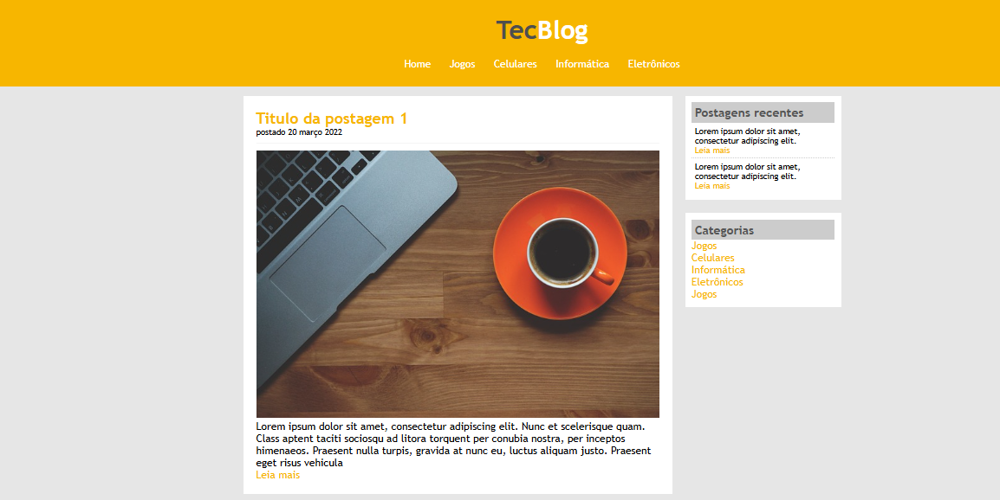
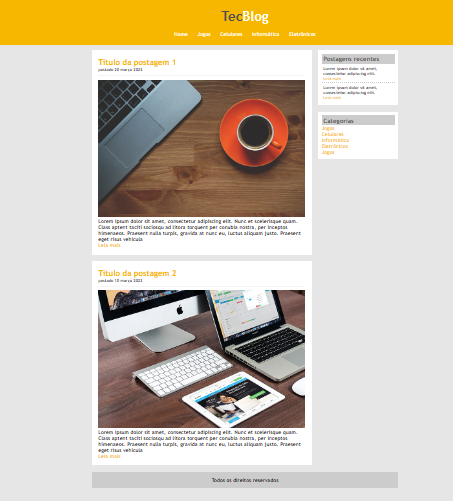

# Exercicio Blog

Este repositório contém um exercício de HTML e CSS para criar um modelo de blog.

## Repositório Original

Você pode encontrar o repositório original [aqui](https://github.com/Nave-git/Exercicio-blog).

## Instruções

1. Faça um **fork** deste repositório para o seu próprio GitHub.
2. Crie as seguintes pastas no seu repositório:
   - `css`
   - `imagens`

3. No diretório raiz, crie um arquivo chamado `index.html`.

## Estrutura do Projeto

A estrutura do seu projeto deve ser semelhante a esta:

## As imagens são as seguinte: 

# Imagem 01

# Imagem 02

